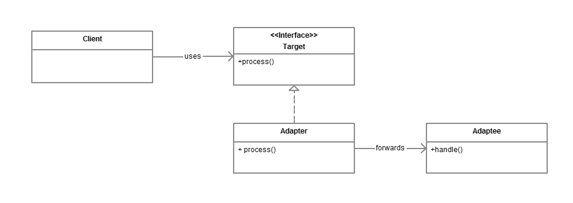

# Adapter design pattern
Pattern type: Structural 

## Definition
Convert the interface of a class into another interface clients expect. Adapter lets classes work together that couldn’t otherwise because of incompatible interfaces.

## Details
Adapter allows to reuse existing coding without changing it, as the adapter ensures the conversion between the different interfaces.

Adapter does not implement new functionality but allows to handle new interfaces/different without reworking clients.

## Example
In provided example we want to make an adapter for an electric car so it can be used in places which accept classic combustion cars only.
We defined two traits - `CombustionCar` and `ElectricCar`, they differ in behaviour. As we want to use `ElectricCar` in methods that accept `ComubstionCar` we've defined a new struct - `ElectricCarAdapter` which takes as argument `ElectricCar` and implements `ComubstionCar` trait. It translate method calls that are used on `ComubstionCar` to methods defined on `ElectricCar`.
