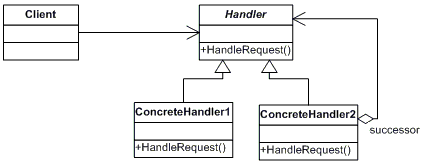

# Chain of Responsibility design pattern
Pattern type: Behavioral

## Definition
Avoid coupling the sender of a request to its receiver by giving more than one object a chance to handle the request. Chain the receiving objects and pass the request along the chain until an object handles it.

## Details

Chain of responsibility pattern is used to achieve loose coupling in software design where a request from the client is passed to a chain of objects to process them. Later, the object in the chain will decide themselves who will be processing the request and whether the request is required to be sent to the next object in the chain or not.

## Example
Provided example focuses on validation user data. `User` struct consists of three fields: `id`, `name` and `email`. Each of this fields is validated separately starting from `id` and when validation passes `user` object is passed to next validator in chain. If validation fails, validation chain is broken an error is returned.