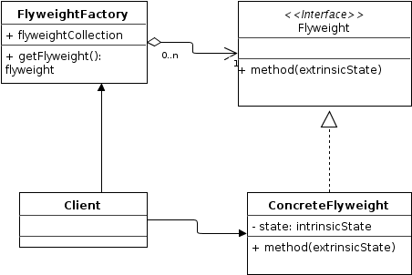

# Flyweight design pattern
Pattern type: Structural

## Definition
Use sharing to support large numbers of fine-grained objects efficiently.

## Details

Flyweight pattern is primarily used to reduce the number of objects created and to decrease memory footprint and increase performance. It is done by reusing already existing similar kind objects by storing them and creates new object when no matching object is found.

## Example
We've created a `CarFactor` that use a HashMap which stores reference to the object which have already been created, every object is associated with a key. Now when a client wants to create an object, he simply has to pass a key associated with it and if the object has already been created we simply get the reference to that object else it creates a new object and then returns it reference to the client. 