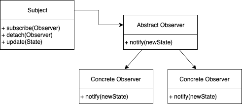

# Observer design pattern
Pattern type: Behavioral

## Definition
Define a one-to-many dependency between objects so that when one object changes state, all its dependents are notified and updated automatically.

## Details

Observer is a pattern that specifies communication between objects: *observable* and *observers*. *Observable* is an object that notifies *observers* about the changes in its state. Pattern focues on *push* type architecture instead of pooling.

## Example
In an example there is a News Agency which can notify channels when it receives any news. Channels can register and deregister from agency. An `Observable` trait is declared for that task which contains such a methods:
* add_observer
* delete_observer
* notify_observers
This trait is implemented by `NewsAgency` struct. That struct also implements method for taking new news and propagating it to all registered Channels. Channel implements `observer` trait, which provides method `update` for receiving new news.