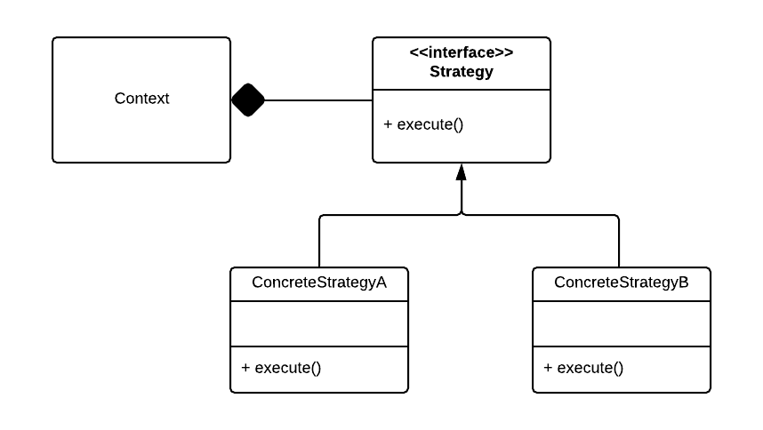

#Strategy design pattern
Pattern type: Behavioral

##Definition
Define a family of algorithms, encapsulate each one, and make them interchangeable. Strategy lets the algorithm vary independently from clients that use it.

##Details

Strategy pattern helps to solve an issue when you need to provide multiple solutions for the same problem and use them interchangeably.

Strategy defines an common interface to all supported alghorithms. Context uses that interface to call the alghorithm defined by ConcreteStrategy.

##Example
Example code tackles down the the problem when we want to have a couple of sorting alghoritms and change them dynamically in our runtime context dynamically.
In code *Strategy* trait is defined, providing method *sort*. It is implemented for two structs: *QuickSort* and *BubbleSort*, which are supossed to sort given array using specified alghoritm. *Context* is a struct, which takes an sorting alghoritm implementation and uses it to sort given array. It doesn't care what is the concrete implementation of *Strategy* as all of them implement same trait.