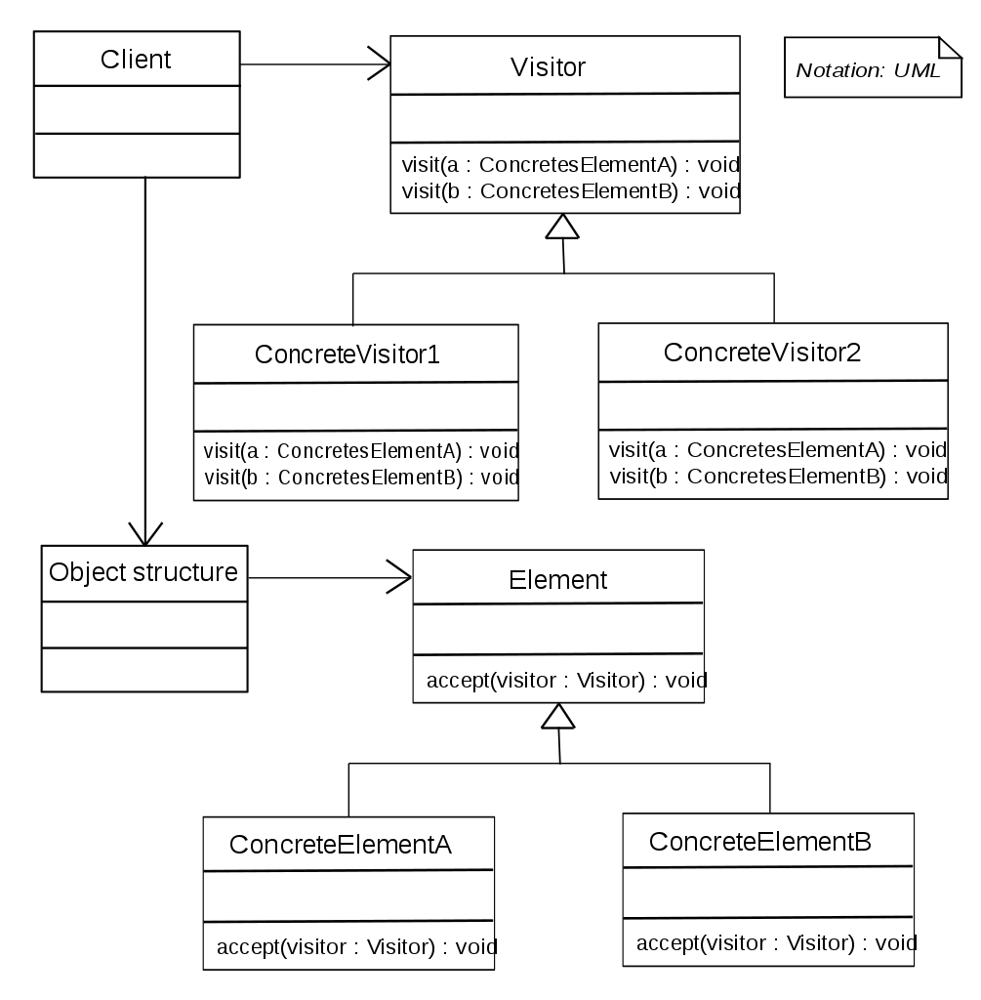

# Visitor design pattern
Pattern type: Behavioral

## Definition
Represent an operation to be performed on the elements of an object structure. Visitor lets you define a new operation without changing the classes of the elements on which it operates.

## Details
The Visitor pattern allows tto add a new behavior into a separate class called visitor, instead of trying to integrate it into existing classes. The original object that had to perform the behavior is now passed to one of the visitor’s methods as an argument, providing the method access to all necessary data contained within the object.

Visitor implements "double dispatch".

## Example
